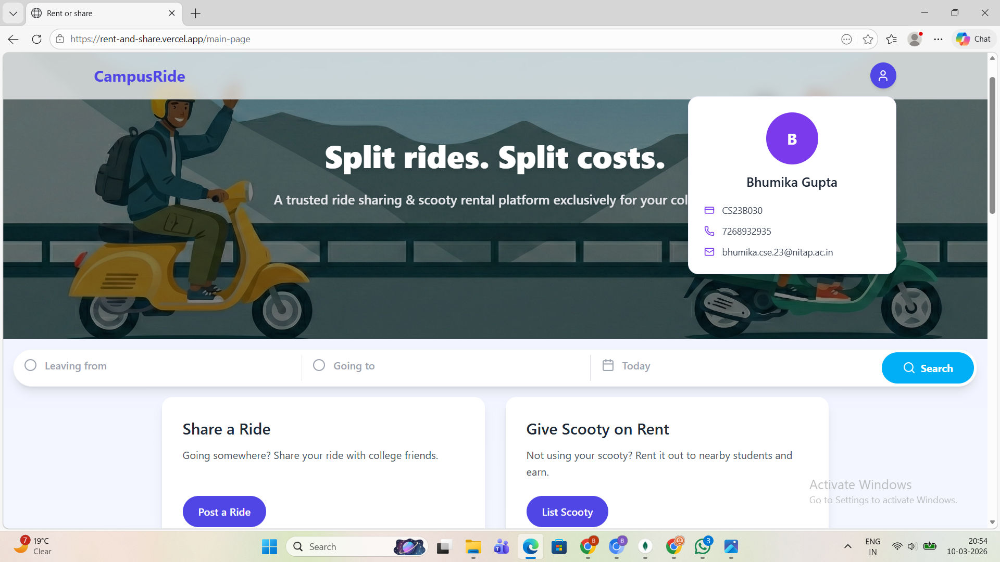
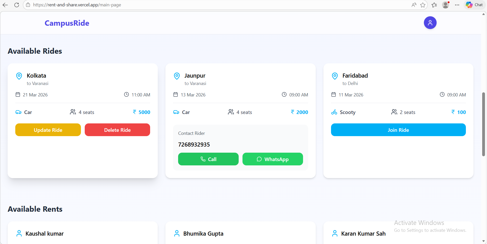
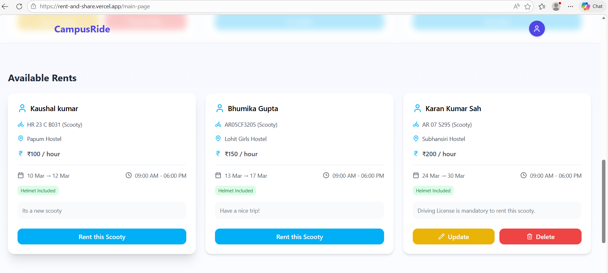

# 🚗 Rent or Share – College Ride Sharing Platform

Rent or Share is a web platform designed for **college students to share rides with classmates and friends**.
Students can post ride details, and others traveling on the same route can join and share travel expenses.

The goal of this project is to **reduce travel costs, make commuting easier, and encourage eco-friendly transportation within the college community.**

---

## 📸 Screenshots





---

## ✨ Features

🔐 **College Email Login**
Only users with valid college email IDs can access the platform.

🚘 **Post a Ride**
Users can create ride posts with details such as:

* Vehicle number
* Contact information
* Departure time
* Fare

👀 **Browse Available Rides**
Students can view rides posted by others and contact them.

🤝 **Ride Sharing**
Students traveling on the same route can connect and share rides.

📱 **Simple UI**
Clean and user-friendly interface for easy navigation.

---

## 🛠️ Tech Stack

### Frontend

* Next.js
* HTML
* CSS
* JavaScript

### Backend

* Node.js
* Express.js

### Database

* MongoDB

### Other Tools

* Git
* GitHub

---

## 🚀 Getting Started

### 1️⃣ Clone the Repository

```bash
git clone https://github.com/yourusername/rent-or-share.git
```

### 2️⃣ Navigate to the Project Folder

```bash
cd rent-or-share
```

### 3️⃣ Install Dependencies

#### Client

```bash
cd client
npm install
```

#### Server

```bash
cd ../server
npm install
```

---

### 4️⃣ Run the Project

Start backend server:

```bash
npm start
```

Start frontend:

```bash
cd client
npm start
```

The project will run on:

```
http://localhost:3000
```

---

## 🎯 Future Improvements

* Google Maps route integration
* Seat availability tracking
* Ride request and approval system
* Chat between riders
* Mobile responsive improvements
* Rating system for riders

---

## 🤝 Contributing

Contributions are welcome!

1. Fork the repository
2. Create a new branch
3. Make your changes
4. Submit a Pull Request

---

## 📄 License

This project is created for **educational and learning purposes**.

---

## 👩‍💻 Author

**Bhumika Gupta**

If you like this project, feel free to ⭐ the repository!
